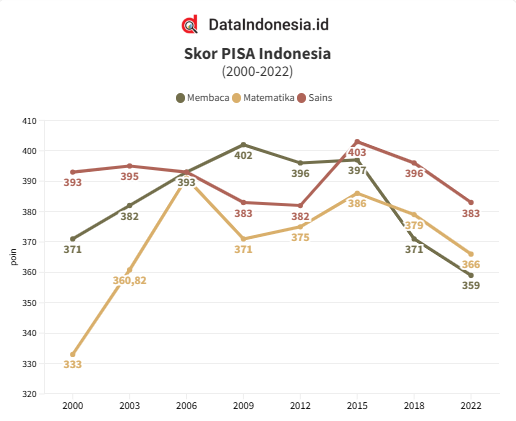
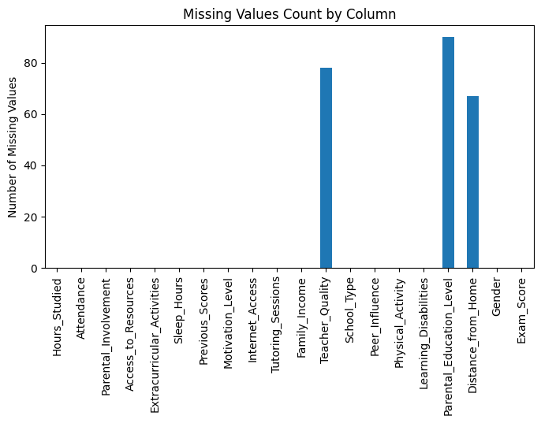

# Laporan Proyek Machine Learning - Nama Anda

Anggota:
- Naufal Arsapradhana (225150701111028)
- Ahmad Faiz Agustianto (225150707111068)
- Kevin Joasua Situmorang (225150707111057)

## Domain Proyek

> **"Pendidikan adalah kunci menuju kemajuan bangsa."**  
Namun, berdasarkan laporan **Programme for International Student Assessment (PISA) 2022** dari **OECD** menunjukkan bahwa kualitas pendidikan Indonesia mengalami penurunan signifikan. Berikut adalah hasil skor rata-rata siswa Indonesia dibandingkan rata-rata OECD

| **Bidang**      | **Skor Indonesia (2022)** | **Rata-rata OECD (2022)** |
|------------------|--------------------------|---------------------------|
| **Matematika**   | 366                      | 472                       |
| **Membaca**      | 359                      | 476                       |
| **Sains**        | 383                      | 485                       |

Hanya **18% siswa** Indonesia yang mencapai tingkat kemahiran minimal (Level 2) dalam matematika, jauh di bawah rata-rata OECD sebesar **69%**. Lebih memprihatinkan, hampir **tidak ada siswa** Indonesia yang masuk kategori berprestasi tinggi (Level 5 atau 6).

Kondisi ini dipengaruhi oleh berbagai faktor internal dan eksternal. Misalnya, faktor eksternal seperti **kualitas fasilitas belajar** dan **tingkat pendapatan orang tua**, serta faktor internal seperti **motivasi siswa** dan **kebiasaan belajar**. Selain itu, dampak pandemi COVID-19 yang memaksa penutupan sekolah hingga lebih dari tiga bulan turut memberikan pengaruh negatif pada hasil belajar siswa.



<sup>Sumber: [Data Kualitas Pendidikan Siswa Indonesia](https://dataindonesia.id/pendidikan/detail/data-kualitas-pendidik)</sup>

Selain itu, sesuai dengan data pada diagram di atas, ditinjau dari skor literasi atau membaca, Indonesia memiliki nilai rata-rata sebesar 359 pada 2022. Angka tersebut menurun 12 poin dibandingkan periode 2018 dengan skor 371. Kemudian, skor numerasi atau perhitungan matematika Indonesia sebesar 366 poin. Nilainya juga turun 13 poin dibandingkan tahun 2018 dengan nilai 379 poin. Selain itu, penilaian sains yang dimiliki Indonesia sebesar 383 poin. Angkanya juga menurun dari 2018 yang sebesar 396 poin.

Untuk mengatasi tantangan ini, pendekatan berbasis data dapat memberikan wawasan yang lebih dalam untuk mendesain intervensi pendidikan yang sesuai. Analisis berbasis data memungkinkan prediksi performa akademik yang lebih akurat dan membantu menciptakan strategi pembelajaran yang disesuaikan dengan kebutuhan individu siswa. Hal ini penting untuk meningkatkan kualitas pendidikan guna mendukung visi Indonesia Emas 2045. 

Pendekatan inovatif ini sejalan dengan rekomendasi OECD untuk mengatasi kesenjangan pendidikan melalui pembelajaran yang lebih adaptif dan terfokus pada kebutuhan siswa, terutama mereka yang berasal dari kelompok kurang beruntung.

Referensi:
- [OECD. (2023). PISA 2022 Results (Volume I and II) - Country Notes](https://www.oecd.org/en/publications/pisa-2022-results-volume-i-and-ii-country-notes_ed6fbcc5-en/indonesia_c2e1ae0e-en.html)
- [OECD Education GPS. (2023). Indonesia - Student Performance (PISA 2022)](https://gpseducation.oecd.org/CountryProfile?primaryCountry=IDN&treshold=10&topic=PI)
- [Data Indonesia. (2023). Data Kualitas Pendidikan Siswa di Indonesia Berdasarkan Hasil PISA 2022](https://dataindonesia.id/pendidikan/detail/data-kualitas-pendidikan-siswa-di-indonesia-berdasarkan-hasil-pisa-2022)


## Business Understanding

Pada bagian ini, terdapat proses klarifikasi masalah yang terdiri dari pernyataan masalah yang melatar belakangi proyek ini dan tujuan proyek dalam menjawab permasalahan yang ada.

### Problem Statements
1. Mengapa kualitas pendidikan di Indonesia mengalami penurunan berdasarkan hasil PISA 2022?
2. Bagaimana keberagaman cara belajar, kebiasaan, dan latar belakang siswa mempengaruhi performa akademik mereka?
3. Mengapa intervensi pendidikan yang diberikan belum sesuai dengan kebutuhan siswa?
4. Apa saja faktor eksternal yang mempengaruhi performa akademik siswa, seperti fasilitas belajar, aktivitas ekstrakurikuler, dan pendapatan orang tua?
5. Bagaimana faktor internal seperti jam tidur, tingkat motivasi, dan durasi belajar siswa mempengaruhi pencapaian akademik mereka?

### Goals
1. Menganalisis penyebab penurunan kualitas pendidikan di Indonesia berdasarkan hasil PISA 2022.
2. Mengidentifikasi pengaruh keberagaman cara belajar, kebiasaan, dan latar belakang siswa terhadap performa akademik mereka
3. Merancang pendekatan intervensi pendidikan yang lebih sesuai dengan kebutuhan siswa berdasarkan hasil analisis.
4. Mengevaluasi dampak faktor eksternal, seperti fasilitas belajar, aktivitas ekstrakurikuler, dan pendapatan orang tua, terhadap performa akademik siswa.
5. Mengukur pengaruh faktor internal, seperti jam tidur, tingkat motivasi, dan durasi belajar, terhadap pencapaian akademik siswa.

### Solution statements
Berdasarkan pernyataan masalah di atas, terdapat beberapa solusi yang dapat dikembangkan untuk menjawab permasalahan tersebut. Diperlukan adanya pendekatan berbasis data yang memungkinkan prediksi performa akademik dengan lebih akurat serta memberikan wawasan mendalam mengenai intervensi pendidikan yang dibutuhkan. Pendekatan berbasis data ini merujuk kepada pengembangan model Machine Learning yang membantu instansi dan pihak pendidikan untuk dapat memprediksi performa siswa berdasarkan faktor eksternal dan internal.

Solusi ini membandingkan 3 algoritma untuk mencari algoritma yang paling efektif dan sesuai untuk mengembangkan sistem prediksi yang sesuai dengan faktor eksternal dan internal siswa. 

 Berikut adalah algoritma yang digunakan:

| **Algoritma**                | **Deskripsi**                                                                                            |
|-------------------------------|---------------------------------------------------------------------------------------------------------|
| Support Vector Regressor  | Menggunakan hyperplane untuk memisahkan data dengan margin maksimal, efektif untuk data berukuran kecil.    |
| Random Forest Regressor   | Memanfaatkan kombinasi pohon keputusan untuk menghasilkan prediksi yang lebih stabil dan akurat.            |
| K-Neighbors Regressor     | Membandingkan data berdasarkan tetangga terdekat, cocok untuk data dengan pola hubungan sederhana.          |

Kemudian, instansi dan pihak pendidikan dapat secara efektif memberikan intervensi fasilitas pendidikan sesuai dengan kebutuhan siswa dalam meningkatkan performa akademik mereka.

## Data Understanding

Pada proyek ini, data yang digunakan bertujuan untuk menganalisis faktor-faktor yang mempengaruhi performa akademik siswa. Dataset ini dapat diakses melalui [Student Performance Factors Dataset di Kaggle](https://www.kaggle.com/datasets/lainguyn123/student-performance-factors/data). Dataset ini mencakup informasi mengenai faktor eksternal dan internal yang dapat mempengaruhi performa akademik siswa dalam ujian matematika dan bahasa Portugis.

### Variabel-variabel pada **Student Performance Factors Dataset**:
| **Attribute**                | **Description**                                                                                                 |
|------------------------------|-----------------------------------------------------------------------------------------------------------------|
| **Hours_Studied**            | Jumlah jam yang dihabiskan siswa untuk belajar per minggu.                                                      |
| **Attendance**               | Persentase kelas yang dihadiri oleh siswa.                                                                      |
| **Parental_Involvement**     | Tingkat keterlibatan orang tua dalam pendidikan siswa (``Low``, ``Medium``, ``High``).                                       |
| **Access_to_Resources**      | Ketersediaan sumber daya pendidikan (``Low``Low``, ``Medium``, ``High``).                                                        |
| **Extracurricular_Activities**| Partisipasi dalam kegiatan ekstrakurikuler (``Yes``, ``No``).                                                           |
| **Sleep_Hours**              | Rata-rata jumlah jam tidur per malam yang dimiliki siswa.                                                       |
| **Previous_Scores**          | Nilai ujian dari ujian sebelumnya.                                                                              |
| **Motivation_Level**         | Tingkat motivasi belajar siswa (``Low``, ``Medium``, ``High``).                                                             |
| **Internet_Access**          | Ketersediaan akses internet di rumah (``Yes``, ``No``).                                                                 |
| **Tutoring_Sessions**        | Jumlah sesi les tambahan yang dihadiri per bulan.                                                               |
| **Family_Income**            | Tingkat pendapatan keluarga (``Low``, ``Medium``, ``High``).                                                                |
| **Teacher_Quality**          | Kualitas pengajaran yang diberikan oleh guru (``Low``, ``Medium``, ``High``).                                               |
| **School_Type**              | Jenis sekolah yang dihadiri (``Public``, ``Private``).                                                                  |
| **Peer_Influence**           | Pengaruh teman-teman terhadap performa akademik siswa (``Positive``, ``Neutral``, ``Negative``).                             |
| **Physical_Activity**        | Rata-rata jumlah jam kegiatan fisik yang dilakukan siswa per minggu.                                            |
| **Learning_Disabilities**    | Adanya gangguan belajar pada siswa (``Yes``, ``No``).                                                                   |
| **Parental_Education_Level** | Tingkat pendidikan orang tua (``High School``, ``College``, ``Postgraduate``).                                              |
| **Distance_from_Home**       | Jarak dari rumah ke sekolah (``Near``, ``Moderate``, ``Far``).                                                              |
| **Gender**                   | Jenis kelamin siswa (``Male``, ``Female``).                                                                             |
| **Exam_Score**               | Nilai ujian akhir siswa, yang menjadi variabel target untuk prediksi performa akademik.                         |

### Data Overview
Untuk melihat lebih dalam isi data, kita dapat menggunakan perintah

```python
# Menampilkan semua data di dalam dataset
data = pd.read_csv('/content/drive/MyDrive/StudentPerformanceFactors.csv')
data
```

| **Hours_Studied** | **Attendance** | **Parental_Involvement** | **Access_to_Resources** | **Extracurricular_Activities** | **Sleep_Hours** | **Previous_Scores** | **Motivation_Level** | **Internet_Access** | **Tutoring_Sessions** | **Family_Income** | **Teacher_Quality** | **School_Type** | **Peer_Influence** | **Physical_Activity** | **Learning_Disabilities** | **Parental_Education_Level** | **Distance_from_Home** | **Gender** | **Exam_Score** |
|--------------------|----------------|--------------------------|-------------------------|--------------------------------|-----------------|----------------------|-----------------------|---------------------|------------------------|-------------------|---------------------|-----------------|--------------------|----------------------|---------------------------|----------------------------|------------------------|------------|----------------|
| 23                 | 84             | Low                      | High                    | No                             | 7               | 73                   | Low                   | Yes                 | 0                      | Low               | Medium              | Public          | Positive           | 3                    | No                        | High School              | Near                   | Male       | 67             |
| 19                 | 64             | Low                      | Medium                  | No                             | 8               | 59                   | Low                   | Yes                 | 2                      | Medium            | Medium              | Public          | Negative           | 4                    | No                        | College                 | Moderate               | Female     | 61             |
| 24                 | 98             | Medium                   | Medium                  | Yes                            | 7               | 91                   | Medium                | Yes                 | 2                      | Medium            | Medium              | Public          | Neutral            | 4                    | No                        | Postgraduate             | Near                   | Male       | 74             |
| 29                 | 89             | Low                      | Medium                  | Yes                            | 8               | 98                   | Medium                | Yes                 | 1                      | Medium            | Medium              | Public          | Negative           | 4                    | No                        | High School              | Moderate               | Male       | 71             |
| 19                 | 92             | Medium                   | Medium                  | Yes                            | 6               | 65                   | Medium                | Yes                 | 3                      | Medium            | High                | Public          | Neutral            | 4                    | No                        | College                 | Near                   | Female     | 70             |
| ...                | ...            | ...                      | ...                     | ...                            | ...             | ...                  | ...                   | ...                 | ...                    | ...               | ...                 | ...             | ...                | ...                  | ...                       | ...                     | ...                    | ...        | ...              |

Untuk melihat informasi lebih lanjut tentang tipe data dan kolom yang ada di dataset, kita dapat menggunakan perintah

```python
data.info()
```

```plaintext
<class 'pandas.core.frame.DataFrame'>
RangeIndex: 6607 entries, 0 to 6606
Data columns (total 20 columns):
 #   Column                      Non-Null Count  Dtype 
---  ------                      --------------  ----- 
 0   Hours_Studied               6607 non-null   int64 
 1   Attendance                  6607 non-null   int64 
 2   Parental_Involvement        6607 non-null   object
 3   Access_to_Resources         6607 non-null   object
 4   Extracurricular_Activities  6607 non-null   object
 5   Sleep_Hours                 6607 non-null   int64 
 6   Previous_Scores             6607 non-null   int64 
 7   Motivation_Level            6607 non-null   object
 8   Internet_Access             6607 non-null   object
 9   Tutoring_Sessions           6607 non-null   int64 
 10  Family_Income               6607 non-null   object
 11  Teacher_Quality             6529 non-null   object
 12  School_Type                 6607 non-null   object
 13  Peer_Influence              6607 non-null   object
 14  Physical_Activity           6607 non-null   int64 
 15  Learning_Disabilities       6607 non-null   object
 16  Parental_Education_Level    6517 non-null   object
 17  Distance_from_Home          6540 non-null   object
 18  Gender                      6607 non-null   object
 19  Exam_Score                  6607 non-null   int64 
dtypes: int64(7), object(13)
```

Untuk mengetahui jumlah baris dan kolom dalam dataset, kita dapat menggunakan perintah
```python
# Mengetahui jumlah baris dan kolom dalam dataset
data.shape
```
```plaintext
(6607, 20)
```

Berdasarkan informasi yang diperoleh dari dataset, terdapat **6607 entri** dan **20 kolom** dengan berbagai tipe data, baik numerik maupun kategorikal. Dataset ini mencakup faktor-faktor eksternal dan internal yang mempengaruhi performa akademik siswa, seperti **jam belajar**, **keterlibatan orang tua**, **akses ke sumber daya**, **kualitas guru**, serta **aktivitas ekstrakurikuler**. Data ini juga menunjukkan adanya beberapa kolom dengan nilai yang hilang, seperti **Teacher_Quality**, **Parental_Education_Level**, dan **Distance_from_Home**.

## Data Preparation
Pada bagian ini, dilakukan beberapa teknik **data preparation** untuk memastikan data yang digunakan dalam model prediksi bersih dan siap diproses lebih lanjut. Berikut adalah tahapan-tahapan yang dilakukan dalam proses persiapan data:

### Pengecekan untuk Data null
Pertama, dilakukan pengecekan terhadap kolom-kolom yang memiliki nilai null atau hilang dengan menggunakan
```python
# Melakukan pengecekan untuk data null
print(data.isnull().sum())
```
```plaintext
Hours_Studied                 0
Attendance                    0
Parental_Involvement          0
Access_to_Resources           0
Extracurricular_Activities    0
Sleep_Hours                   0
Previous_Scores               0
Motivation_Level              0
Internet_Access               0
Tutoring_Sessions             0
Family_Income                 0
Teacher_Quality               78
School_Type                   0
Peer_Influence                0
Physical_Activity             0
Learning_Disabilities         0
Parental_Education_Level      90
Distance_from_Home            67
Gender                        0
Exam_Score                    0
dtype: int64
```

Langkah ini dilakukan untuk mengidentifikasi kolom yang memiliki data hilang (null). Data yang hilang dapat mempengaruhi kualitas analisis dan pemodelan

### Visualisasi Missing Data
Untuk lebih memahami distribusi data yang hilang, dilakukan visualisasi dengan diagram batang untuk melihat jumlah nilai hilang di setiap kolom.
```python
# Memvisualisasikan kolom yang memiliki null value
missing_data = data.isnull().sum()

# Visualisasi menggunakan diagram batang
missing_data.plot(kind='bar', figsize=(8, 4))
plt.title("Missing Values Count by Column")
plt.ylabel("Number of Missing Values")
plt.show()
```


Visualisasi ini membantu untuk memberikan gambaran yang jelas dan cepat mengenai sebaran data yang hilang di setiap kolom

### Imputation
Untuk menangani nilai yang hilang, dilakukan imputasi data dengan ketentuan:
- Menggunakan nilai rata-rata (``mean``) untuk mengisi nilai yang hilang pada kolom numerik.
- Menggunakan nilai terbanyak (``most_frequent``) untuk mengisi nilai yang hilang pada kolom kategorikal.

```python
# Imputasi data numerik
num_imputer = SimpleImputer(strategy='mean')
data[numerical_cols] = num_imputer.fit_transform(data[numerical_cols])

# Imputasi data kategorikal
cat_imputer = SimpleImputer(strategy='most_frequent')
data[categorical_cols] = cat_imputer.fit_transform(data[categorical_cols])
```

Imputasi dilakukan untuk mengganti nilai yang hilang dengan nilai yang masuk akal, yaitu rata-rata untuk data numerik dan nilai terbanyak untuk data kategorikal. Tanpa imputasi, nilai yang hilang bisa menyebabkan error atau bias dalam model prediksi

Setelah imputasi, dilakukan pengecekan kembali untuk memastikan tidak ada lagi nilai null dalam dataset.

```python
# Melakukan pengecekan untuk kolom dengan null value
print(data.isnull() .sum())
```
```plaintext
Hours_Studied                 0
Attendance                    0
Parental_Involvement          0
Access_to_Resources           0
Extracurricular_Activities    0
Sleep_Hours                   0
Previous_Scores               0
Motivation_Level              0
Internet_Access               0
Tutoring_Sessions             0
Family_Income                 0
Teacher_Quality               0
School_Type                   0
Peer_Influence                0
Physical_Activity             0
Learning_Disabilities         0
Parental_Education_Level      0
Distance_from_Home            0
Gender                        0
Exam_Score                    0
dtype: int64
```

Pengecekan ini memastikan bahwa tidak ada nilai yang hilang setelah proses imputasi, yang membuat dataset siap digunakan untuk model tanpa ada kekurangan data.


Terakhir, dilakukan pengecekan untuk memastikan tidak ada data duplikat dalam dataset.

```python
# Melakukan pengecekan adanya duplikasi data
data.duplicated().sum()
```
```plaintext
0
```

Pengecekan duplikasi dilakukan untuk memastikan dataset bersih dari entri yang terulang.


Proses **data preparation** yang dilakukan ini melibatkan pengecekan dan penanganan data hilang dengan imputasi, baik untuk kolom numerik menggunakan rata-rata dan untuk kolom kategorikal dengan nilai terbanyak. Setelah imputasi, data kembali diperiksa dan tidak ditemukan nilai yang hilang. Selain itu, pengecekan duplikasi memastikan tidak ada data yang terduplikasi.

## Modeling
Pada tahap ini, dilakukan proses pemodelan untuk memprediksi nilai ujian akhir siswa (**Exam_Score**) berdasarkan faktor-faktor internal dan eksternal. Proses ini mencakup pembagian data, standarisasi fitur, dan pelatihan model menggunakan tiga algoritma berbeda: **Random Forest Regressor**, **Support Vector Regressor (SVR)**, dan **K-Neighbors Regressor (KNN)**. Berikut adalah tahapan yang dilakukan:

### Pembagian Dataset (Train-Test Split)
Dataset dibagi menjadi dua bagian utama:
- **Training Set (80%)**: Digunakan untuk melatih model.
- **Testing Set (20%)**: Disisihkan untuk evaluasi model di tahap berikutnya.

```python
from sklearn.model_selection import train_test_split

# Membagi data menjadi fitur (X) dan target (y)
X_train, X_test, y_train, y_test = train_test_split(X, y, test_size=0.2, random_state=42)
```
- Memastikan model memiliki data yang berbeda untuk pelatihan dan pengujian sehingga evaluasi model menjadi lebih objektif.
- Mengurangi risiko overfitting dengan menyediakan data yang tidak pernah dilihat model selama pelatihan.

### Standarisasi Fitur (Feature Scaling)
Setelah membagi data, dilakukan proses standarisasi untuk memastikan semua fitur berada pada skala yang sama. Hal ini dilakukan menggunakan ``StandardScaler`` dari scikit-learn:

```python
from sklearn.preprocessing import StandardScaler

# Standarisasi fitur
scaler = StandardScaler()
X_train_scaled = scaler.fit_transform(X_train)
X_test_scaled = scaler.transform(X_test)  
```
- Menormalkan data untuk model yang sensitif terhadap skala data, seperti Support Vector Regressor (SVR) dan K-Neighbors Regressor (KNN).
- Meningkatkan stabilitas numerik algoritma dan membantu model berperforma lebih baik.

### Pemilihan dan Inisialisasi Model
Tiga algoritma machine learning digunakan dalam proses ini untuk membangun model prediksi. Berikut adalah model yang digunakan:
- Random Forest Regressor: Model ensemble berbasis pohon keputusan.
- Support Vector Regressor (SVR): Model yang menggunakan hyperplane dan kernel untuk prediksi.
- K-Neighbors Regressor (KNN): Model berbasis instance yang memprediksi target berdasarkan tetangga terdekat.

```python
from sklearn.ensemble import RandomForestRegressor
from sklearn.svm import SVR
from sklearn.neighbors import KNeighborsRegressor

# Model Training, Cross-Validation, and Evaluation
from sklearn.model_selection import cross_val_score

from sklearn.metrics import mean_absolute_error, mean_squared_error, r2_score
from sklearn.preprocessing import StandardScaler

# Inisialisasi Model
classifiers = [
    RandomForestRegressor(),
    SVR(),
    KNeighborsRegressor()
] 
```
- Memilih algoritma yang sesuai untuk memprediksi nilai ujian akhir siswa berdasarkan faktor-faktor yang tersedia.
- Menginisialisasi model dengan parameter default sebelum melanjutkan ke proses pelatihan.

### Tanpa StandardScaler
Proses pertama dilakukan tanpa menggunakan standarisasi fitur untuk mengetahui performa awal model pada data mentah. Langkah-langkahnya mencakup validasi silang (``cross-validation``) dan pelatihan model.
```python
withoutresults = {}
for model in classifiers:
  model_name = model.__class__.__name__
   print(f"\nTraining {model_name}...")

  # Melakukan validasi silang (5-fold cross-validation) untuk mengevaluasi performa model secara lebih umum menggunakan skor R
  cv_scores = cross_val_score(model, X_train, y_train, cv=5, scoring='r2')

  # Menyesuaikan model dengan training set
  model.fit(X_train, y_train)

  # Prediksi
  y_pred = model.predict(X_test)

  # Metriks evaluasi
  r2 = r2_score(y_test, y_pred)
  mae = mean_absolute_error(y_test, y_pred)
  mse = mean_squared_error(y_test, y_pred)

  # Menyimpan hasil
  withoutresults[model_name] = {
      "CV R²": np.mean(cv_scores),
      "Test R²": r2,
      "MAE": mae,
      "MSE": mse
}
```
- Melakukan validasi silang untuk mengevaluasi performa model pada data pelatihan dengan membagi data menjadi lima lipatan (folds).
- Melatih model menggunakan data pelatihan mentah untuk menghasilkan model dasar tanpa preprocessing tambahan.

### Menampilkan Hasil Tanpa StandardScaler
```python
# Menampilkan hasil
for model_name, metrics in withoutresults.items():
    print(f"\nModel: {model_name}")
    for metric_name, value in metrics.items():
        print(f"{metric_name}: {value:.4f}")
```

```plaintext
Model: RandomForestRegressor
CV R²: 0.6141
Test R²: 0.6482
MAE: 1.1597
MSE: 4.9728

Model: SVR
CV R²: 0.6808
Test R²: 0.7325
MAE: 0.7647
MSE: 3.7814

Model: KNeighborsRegressor
CV R²: 0.2701
Test R²: 0.2970
MAE: 2.2265
MSE: 9.9364
```

Hasil Pengukuran:
| Model | CV R² | Test R² | MAE | MSE |
| --- | --- | --- | --- | --- |
| RandomForestRegressor | 0.6183 | 0.6560 | 1.1392 | 4.8629 |
| SVR (Support Vector Regressor) | 0.6808 | 0.7325 | 0.7647 | 3.7814 |
| KNeighborsRegressor | 0.2701 | 0.2970 | 2.2265 | 9.9364 |

- SVR adalah model terbaik berdasarkan metrik evaluasi, karena memiliki skor R² tertinggi dan error terendah.
- Model Random Forest cukup kompetitif, tetapi tidak sebaik SVR.
- Model K-Neighbors memiliki performa terburuk yang mungkin disebabkan oleh sensitivitasnya terhadap ukuran dataset atau distribusi data.

### Dengan StandardScaler
Proses berikutnya dilakukan dengan menggunakan data yang telah di-scaling menggunakan StandardScaler. Standarisasi ini memastikan bahwa model yang sensitif terhadap skala data dapat bekerja lebih optimal.
```python
results = {}
for model in classifiers:
    model_name = model.__class__.__name__
    print(f"\nTraining {model_name}...")

    # Cross-validation (5-fold)
    cv_scores = cross_val_score(model, X_train_scaled, y_train, cv=5, scoring='r2')

    # Menyesuaikan model dengan training set
    model.fit(X_train_scaled, y_train)

    # Prediksi
    y_pred = model.predict(X_test_scaled)

    # Metriks evaluasi
    r2 = r2_score(y_test, y_pred)
    mae = mean_absolute_error(y_test, y_pred)
    mse = mean_squared_error(y_test, y_pred)

    # Menyimpan hasil
    results[model_name] = {
      "CV R²": np.mean(cv_scores),
      "Test R²": r2,
      "MAE": mae,
      "MSE": mse
}
```
- Memanfaatkan data yang telah di-scaling untuk meningkatkan performa model yang sensitif terhadap skala data, seperti SVR dan KNN.
- Membandingkan hasil validasi silang antara model dengan dan tanpa scaling untuk menentukan dampak preprocessing terhadap performa model.

### Menampilkan Hasil Dengan StandardScaler
```python
# Menampilkan hasil
for model_name, metrics in results.items():
    print(f"\nModel: {model_name}")
    for metric_name, value in metrics.items():
        print(f"{metric_name}: {value:.4f}")
```

```plaintext
Model: RandomForestRegressor
CV R²: 0.6143
Test R²: 0.6456
MAE: 1.1511
MSE: 5.0096

Model: SVR
CV R²: 0.6825
Test R²: 0.7324
MAE: 0.7682
MSE: 3.7823

Model: KNeighborsRegressor
CV R²: 0.4700
Test R²: 0.4988
MAE: 1.6828
MSE: 7.0843
```

Hasil Pengukuran:

| Model | CV R² | Test R² | MAE | MSE |
| --- | --- | --- | --- | --- |
| RandomForestRegressor | 0.6184 | 0.6510 | 1.1548 | 4.9325 |
| SVR | 0.6825 | 0.7324 | 0.7682 | 3.7823 |
| KNeighborsRegressor | 0.4700 | 0.4988 | 1.6828 | 7.0843 |

- Proses ini mengubah data ke dalam bentuk distribusi normal dengan rata-rata 0 dan standar deviasi 1. Hal ini membantu algoritma tertentu seperti SVR dan KNeighborsRegressor, yang sensitif terhadap skala fitur.
- SVR adalah model terbaik dalam eksperimen ini, terutama karena sensitif terhadap data yang diskalakan dengan StandardScaler.
- Random Forest juga memberikan hasil yang cukup baik tetapi tidak seoptimal SVR.
- KNeighborsRegressor tidak bekerja dengan baik dalam skenario ini, mungkin karena sifat dataset yang lebih cocok untuk model non-lokal atau kompleks.

## Evaluation
Pada bagian ini anda perlu menyebutkan metrik evaluasi yang digunakan. Lalu anda perlu menjelaskan hasil proyek berdasarkan metrik evaluasi yang digunakan.

Sebagai contoh, Anda memiih kasus klasifikasi dan menggunakan metrik **akurasi, precision, recall, dan F1 score**. Jelaskan mengenai beberapa hal berikut:
- Penjelasan mengenai metrik yang digunakan
- Menjelaskan hasil proyek berdasarkan metrik evaluasi

Ingatlah, metrik evaluasi yang digunakan harus sesuai dengan konteks data, problem statement, dan solusi yang diinginkan.

**Rubrik/Kriteria Tambahan (Opsional)**: 
- Menjelaskan formula metrik dan bagaimana metrik tersebut bekerja.

**---Ini adalah bagian akhir laporan---**

_Catatan:_
- _Anda dapat menambahkan gambar, kode, atau tabel ke dalam laporan jika diperlukan. Temukan caranya pada contoh dokumen markdown di situs editor [Dillinger](https://dillinger.io/), [Github Guides: Mastering markdown](https://guides.github.com/features/mastering-markdown/), atau sumber lain di internet. Semangat!_
- Jika terdapat penjelasan yang harus menyertakan code snippet, tuliskan dengan sewajarnya. Tidak perlu menuliskan keseluruhan kode project, cukup bagian yang ingin dijelaskan saja.

